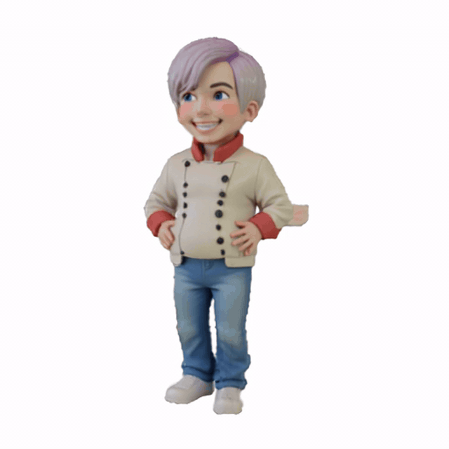

# LucidFusion: Generating 3D Gaussians with Arbitrary Unposed Images

[Hao He](https://heye0507.github.io/)$^{\*}$ [Yixun Liang](https://yixunliang.github.io/)$^{\*}$, [Luozhou Wang](https://wileewang.github.io/), [Yuanhao Cai](https://github.com/caiyuanhao1998), [Xinli Xu](https://scholar.google.com/citations?user=lrgPuBUAAAAJ&hl=en&inst=1381320739207392350), [Hao-Xiang Guo](), [Xiang Wen](), [Yingcong Chen](https://www.yingcong.me)$^{\**}$

\*: Equal contribution.
\**: Corresponding author.

[Paper PDF (Arxiv)](https://arxiv.org/abs/2410.15636) | [Project Page](https://heye0507.github.io/LucidFusion_page/) | [Model Weights](https://huggingface.co/heye0507/LucidFusion) | [Gradio Demo](Coming Soon) 

---

<div align="center">
      
    <br>
    <p><i>Note: we compress these motion pictures for faster previewing.</i></p>
</div>

<div align=center>
  
  
Examples of cross-dataset content creations with our framework, the *LucidFusion*, around **~13FPS** on A800.

</div>

## 📢 News
- 2024-11-04: LucidFusion now supports 512x512 resolution inputs. Demo results released, and we will release the model soon!   <be>

### Demo results of 512 model

<p align="center">
  
  
  
</p>

<p align="center">
  
  
  
</p>


## 🎏 Abstract
We present a flexible end-to-end feed-forward framework, named the *LucidFusion*, to generate high-resolution 3D Gaussians from unposed, sparse, and arbitrary numbers of multiview images.

<details><summary>CLICK for the full abstract</summary>

> Recent large reconstruction models have made notable progress in generating high-quality 3D objects from single images. However, these methods often struggle with controllability, as they lack information from multiple views, leading to incomplete or inconsistent 3D reconstructions. To address this limitation, we introduce LucidFusion, a flexible end-to-end feed-forward framework that leverages the Relative Coordinate Map (RCM).  Unlike traditional methods linking images to 3D world thorough pose, LucidFusion utilizes RCM to align geometric features coherently across different views, making it highly adaptable for 3D generation from arbitrary, unposed images. Furthermore, LucidFusion seamlessly integrates with the original single-image-to-3D pipeline, producing detailed 3D Gaussians at a resolution of $512 \times 512$, making it well-suited for a wide range of applications.

</details>

## 🔧 Training Instructions

Our inference code is now released! We will release our training code soon!

### Install
```
conda create -n LucidFusion python=3.9.19
conda activate LucidFusion

# For example, we use torch 2.3.1 + cuda 11.8, and tested with latest torch (2.4.1) which works with the latest xformers (0.0.28).
pip install torch==2.4.1 torchvision==0.19.1 torchaudio==2.4.1 --index-url https://download.pytorch.org/whl/cu118

# Xformers is required! please refer to https://github.com/facebookresearch/xformers for details.
# [linux only] cuda 11.8 version
pip3 install -U xformers --index-url https://download.pytorch.org/whl/cu118

# For 3D Gaussian Splatting, we use LGM modified version, details please refer to https://github.com/3DTopia/LGM
git clone --recursive https://github.com/ashawkey/diff-gaussian-rasterization
pip install ./diff-gaussian-rasterization

# Other dependencies
pip install -r requirements.txt
```

### Pretrained Weights
Our pre-trained weight is now released! Please check [weights](https://huggingface.co/heye0507/LucidFusion).

To download the pre-trained weights, simply run
```
python download.py
```


## 🔥 Inference
A shell script is provided with example files. Please make sure pre-trained weights is downloaded in the "pretrained" folder
```
cd LucidFusion
mkdir output/demo
```
We have also provided some preprocessed examples.

For GSO files, the example objects are "alarm", "chicken", "hat", "lunch_bag", "mario", and "shoe1".

To run GSO demo:
```
# You can adjust "DEMO" field inside the gso_demo.sh to load other examples.

bash scripts/gso_demo.sh
```

To run the images demo, masks are obtained using preprocess.py. The example objects are "nutella_new", "monkey_chair", "dog_chair".

```
bash scripts/demo.sh
```

To run the diffusion demo as a single-image-to-multi-view setup, we use the pixel diffusion trained in the CRM, as described in the paper. You can also use other multi-view diffusion models to generate multi-view outputs from a single image.

For dependencies issue, please check https://github.com/thu-ml/CRM

We also provide LGM's imagegen diffusion, simply set --crm=false in diffusion_demo.sh. You can change the --seed with different seed option.

```
bash script/diffusion_demo.sh
```


You can also try your own example! To do that:

1. Obtain images and place them in the examples folder:
```
LucidFusion
├── examples/
|   ├── "your obj name"/
|   |   ├── "image_01.png"
|   |   ├── "image_02.png"
|   |   ├── ...
```
2. Run preprocess.py to extract the recentered image and its mask:
```
# Run the following will create two folders (images, masks) in "your-obj-name" folder.
# You can check to see if the extract mask is corrected.
python preprocess.py examples/you-obj-name --outdir examples/your-obj-name
```

3. Modify demo.sh to set DEMO=“examples/your-obj-name”, then run the script:
```
bash scripts/demo.sh
```

## 🤗 Gradio Demo

For Gradio Demo test version, simply run
```
python app.py
```

Please note this demo is still under development, and check back later for the full version!

## 🚧 Todo

- [x] Release the inference codes
- [x] Release our weights
- [ ] Release the Gardio Demo
- [ ] Release the Stage 1 and 2 training codes

## 📍 Citation 
If you find our work useful, please consider citing our paper.
```
@misc{he2024lucidfusion,
      title={LucidFusion: Generating 3D Gaussians with Arbitrary Unposed Images}, 
      author={Hao He and Yixun Liang and Luozhou Wang and Yuanhao Cai and Xinli Xu and Hao-Xiang Guo and Xiang Wen and Yingcong Chen},
      year={2024},
      eprint={2410.15636},
      archivePrefix={arXiv},
      primaryClass={cs.CV},
      url={https://arxiv.org/abs/2410.15636}, 
}
```

## 💼 Acknowledgement
This work is built on many amazing research works and open-source projects:
- [gaussian-splatting](https://github.com/graphdeco-inria/gaussian-splatting) and [diff-gaussian-rasterization](https://github.com/graphdeco-inria/diff-gaussian-rasterization)
- [ZeroShape](https://github.com/zxhuang1698/ZeroShape)
- [LGM](https://github.com/3DTopia/LGM)

Thanks for their excellent work and great contribution to 3D generation area.
